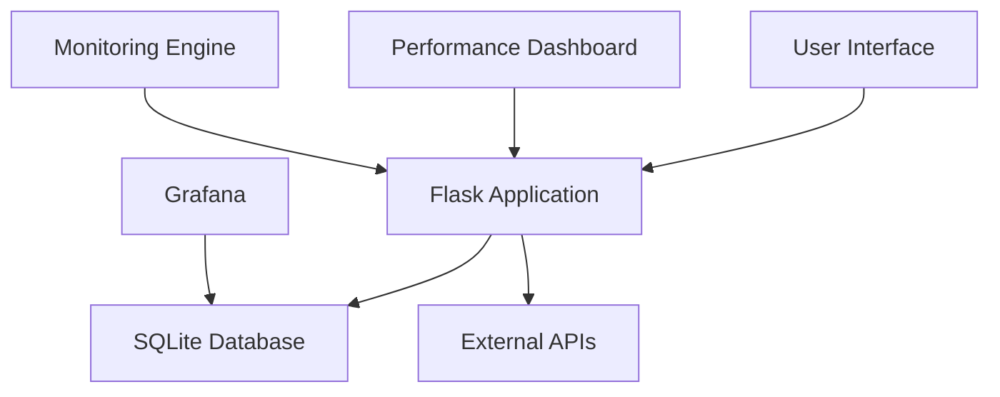

```mermaid
graph TB
    A[User Interface] --> B[Flask Application]
    B --> C[SQLite Database]
    B --> D[External APIs]
    E[Performance Dashboard] --> B
    F[Monitoring Engine] --> B
    G[Grafana] --> C
```